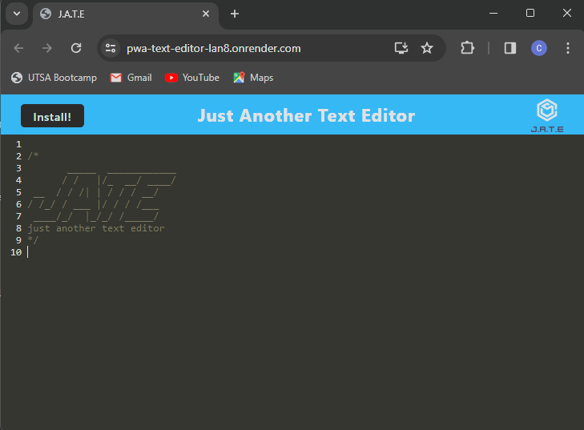

# PWA-text-editor

 ## Table of Contents
  * [Description](#description)
  * [Technologies](#technologies-used)
  * [Installation](#installation)
  * [Usage](#usage)
  * [Contributing](#contributing)
  * [Questions](#questions) 
  * [Acknowledgements](#acknowledgements)

## Description

In this project, I created a text editor application that meets Progressive Web Apps (PWA) criteria. This single page application can run in the browser and it can also be installed locally to run offline. 

### Technologies Used
- IndexedDB as a database
- Webpack to bundle front-end code
- Workbox to create a service worker that caches static assets
- And Render to deploy the application 

### User Story

```
AS A developer
I WANT to create code snippets with or without an internet connection
SO THAT I can reliably retrieve them for later use.
```

### Screenshot of Application


This application is deployed on `Render`. To access it, click [here](https://pwa-text-editor-lan8.onrender.com/).

## Installation
  * [Node.js](https://nodejs.org/en). Use command "node -v" in the terminal to see if it is already installed on your computer

## Usage
To use the application from the command line (after installing dependencies):
- Use command `npm install` to install dependencies
- Use command `npm run build` to build front-end code
- Use command `npm start` to start the server on your localhost

## Contributing 
- Fork the repository and code away! 


## Questions
Contact me with questions: 
- https://github.com/ccarroll929 
- ccarroll0528@gmail.com

## Acknowledgements 
This application uses [starter code](https://github.com/coding-boot-camp/cautious-meme) 